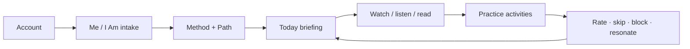
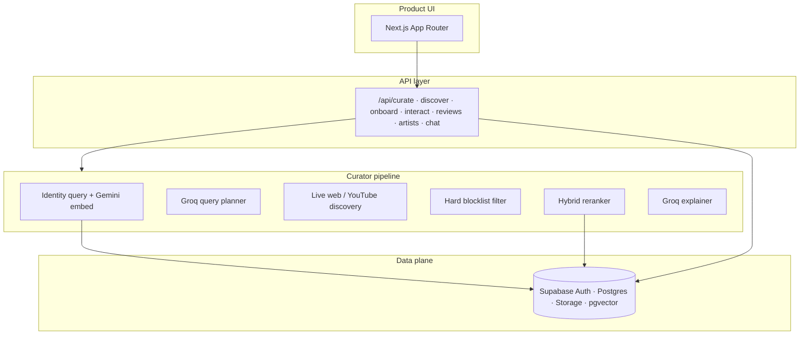

# Vector

### Daily media for who you're becoming

Built on the **I Am Better Than Me** identity model  
Me → I Am → Method → daily practice

<div class="pt-8 text-sm opacity-70">
  Hackathon deliverable · Working product · Executive briefing
</div>

---
layout: default
---

# Agenda

| # | Topic |
|---|--------|
| 01 | How Vector sits inside the IABTM vision |
| 02 | What we shipped (product, not pitchware) |
| 03 | End-to-end user experience |
| 04 | Curation system design |
| 05 | How feedback reshapes the next day |
| 06 | Stack, data, and what is demoable now |
| 07 | Where this can go next for the company |

Goal of this deck: give leadership a clear picture of **what was built, why it fits, and how it works under the hood**.

---
layout: default
---

# Built on I Am Better Than Me

IABTM already gives people a powerful language for growth:

- **Me** — who I am today  
- **I Am** — who I am becoming  
- **Method** — how I close that gap  
- **Path** — a sustained journey, not a one-off tip  

Vector does not replace that philosophy. It **operationalizes it every day** with media and practice that match the path the person is already on.

<div class="mt-6 p-4 rounded bg-gray-50 text-sm">
  Same identity inputs the company already believes in. A live curator layer on top that finds, ranks, and explains what to engage with today.
</div>

---
layout: two-cols
---

# The opportunity we explored

People on a growth path still consume a lot of media.

The open web is excellent at discovery volume.  
It is weaker at tying content to a **specific identity gap**.

::right::

### What Vector adds

- Search the live web for today's moment  
- Rank for **identity fit and potential**  
- Pair media with **practice activities**  
- Learn from honest feedback  
- Keep the Me / I Am / Method spine intact  

Framed as an **extension** of IABTM's work: turn identity into a daily briefing people can act on.

---
layout: default
---

# What Vector is

**Vector** is an agentic media curator.

You describe who you are and who you want to become. The system assigns a method, then each day:

1. Builds a live **identity query** (text + embedding)  
2. Plans search queries and activities  
3. Discovers candidates from YouTube and the web  
4. Reranks with hybrid vector + rule scoring  
5. Explains why this pick fits **today**  
6. Updates tomorrow from ratings, skips, and blocks  

Tagline we use in-product: *potential, not attention.*

---
layout: default
---

# Product surfaces shipped

| Surface | What the member gets |
|---------|----------------------|
| **Onboarding** | Me / I Am attributes, calibrating questions, learning styles, method assignment |
| **Today** | Primary embedded pick, why-now copy, alternatives, practice activities |
| **Discover** | Live search by type: film, podcast, people, music, editorial, animation |
| **Your paths** | Multiple journeys; switch or start a new Me → I Am arc |
| **Artists / mentors** | Personality recommendations with like / dislike feedback |
| **Shop match** | Style-axis merch ranking tied to path stage and identity |
| **How it works** | In-app architecture page for transparency |
| **Vector Companion** | Chat grounded in path memory, reviews, and briefing context |

This is a runnable Next.js app with auth, persistence, and live discovery — not a Figma-only concept.

---
layout: default
---

# Member journey



### Design intent

- One clear primary pick so the day has a center of gravity  
- Activities beside media so insight becomes practice  
- Feedback that actually changes the next curation run  
- Multiple paths for different life arcs without losing history  

---
layout: two-cols
---

# Onboarding in detail

### Capture
- Profile (name, photo)  
- **Me** attributes (current self)  
- **I Am** attributes (aspirational self)  
- Optional questions + learning styles  

### Assign
- A growth **method** matched to the gap  
- Path saved with day counter and identity embedding  

::right::

### Why this matters for curation

The curator never starts from a blank prompt.

Every search and score is anchored to:

- Me labels  
- I Am labels  
- Method  
- Journey stage (early / middle / late)  
- Recent behavior signals  

That is the IABTM spine, made machine-usable.

---
layout: default
---

# Today: the daily briefing

| Element | Role |
|---------|------|
| Primary media | Embedded YouTube / Spotify where possible |
| Why-now | Short, concrete explanation tied to the path |
| Alternatives | Diversified secondary picks (other formats) |
| Activities | Outdoor / indoor / social / reflection / movement |
| Actions | Resonated · Don't show again · Rate with stars · Skip activity |

### UX shell
Three-column workspace: left nav, main briefing, right activity panel.  
Both sidebars collapse and are **drag-resizable**; state persists locally.

---
layout: default
---

# Discover, paths, and mentors

### Discover
On-demand live search per media type. Tabs are session-cached so switching types stays fast while still pulling real web results.

### Paths
Members can hold more than one journey (for example: focus at work vs. confidence in relationships). Active path drives today's curator.

### Artists / mentors
Recommend thinkers and creators aligned to interests inferred from the path. Likes boost related voices; dislikes remove them from the mentor list and soft-steer media search away.

### Shop
Apparel candidates scored on style axes (energy, visibility, discipline, body, creativity) against the path — same identity, another surface.

---
layout: default
---

# System architecture



Separation of concerns: models **plan and explain**; deterministic ranking **chooses**.

---
layout: default
---

# Curation pipeline (end to end)

| Step | Owner | Output |
|------|--------|--------|
| 1. Behavior load | Pipeline | Reviews, skips, artist feedback, completes, chat prefs |
| 2. Identity block | Gemini | Live query string + 768-d embedding |
| 3. Query plan | Groq | Per-type search queries + activity ideas |
| 4. Discovery | Web / YouTube | Candidate media items |
| 5. Hard filter | Rules | Drop exact blocked ids before scoring |
| 6. Optional critic | Agent | Observe weak pass; retry search once if needed |
| 7. Hybrid rerank | Math | Final ordered shortlist + type diversity |
| 8. Explain | Groq | reason / whyNow / primaryWhy |
| 9. Persist | Supabase | Briefing cache + path signals |

The LLM is never the sole picker of the winning video.

---
layout: default
---

# Identity block: the live vector

Each curate run rebuilds a text block roughly like:

```
Current self: …
Imagined self: …
Method: …
Journey day N (early|middle|late)
Preferred learning styles: …
Recently practiced: …
Liked / disliked titles + reasons: …
Avoid / prefer mentors: …
Skipped activities → prefer gentler alternatives
Companion chat preferences: …
Optimize for human potential and identity growth
```

That string is embedded with **Gemini (768-d)** and compared to media embeddings when available.  
Stored on the path for pgvector-ready similarity. Soft feedback changes the **next** identity query — Me / I Am labels stay human-owned.

---
layout: two-cols
---

# Hybrid reranker

### Signals in the score
- Identity fit (vector cosine + lexical Me/I Am/method)
- Semantic overlap with the live query  
- Duration vs journey stage (and returner softness)  
- Method token fit  
- Learning-style fit  
- Novelty (seen / blocked ids)  
- Anti-clickbait heuristics  
- Feedback fit (boost likes, punish dislike lookalikes)

::right::

### Design choice

| Approach | Limitation alone |
|----------|------------------|
| Lexical only | Misses synonyms |
| pgvector only | Live web isn't pre-indexed |
| LLM alone | Hard to audit; can chase hype |

**Hybrid** keeps identity vectors in Supabase, discovers live, embeds a shortlist, scores with cosine + rules.

Transparent enough for product and leadership review.

---
layout: default
---

# Feedback: hard vs soft (important)

| Signal | Storage | Effect |
|--------|---------|--------|
| 1★ / Don't show again | `media_reviews` + interaction | **Hard ban** on exact media id (`yt_…` / `web_…`) |
| Low rating + written reason | `media_reviews` | Soft: identity text + planner avoidHints + rerank penalty |
| High rating / Resonated | reviews + interactions | Soft: prefer similar depth / tone |
| Skip activity | check-in `Skipped activity: …` | Soft: gentler alternatives next plan |
| Complete activity | check-in + interaction | Soft: deepen related practice |
| Dislike artist | `artist_feedback` | Hard drop in Artists UI; soft avoid in media search |
| Like artist | `artist_feedback` | Soft boost related voices |

Exact item you rejected does not come back. Similar tone is steered down, not magically deleted from the internet.

---
layout: default
---

# Agent memory without overclaiming

What updates on each run:

- Live identity query text and embedding  
- Search queries (planner sees avoid / prefer hints)  
- Ranking weights via feedbackFit and novelty  
- Activity suggestions intensity  

What does **not** silently mutate:

- The member's chosen Me / I Am attributes (those stay explicit)  
- A forever-ban on an entire genre unless they keep blocking specifics  

Honest loop: human in control of identity labels; system learns preference at the content and tone layer.

---
layout: default
---

# Data model (high level)

| Table / store | Purpose |
|---------------|---------|
| `profiles` | Display name, styles, onboarding flag, avatar (Storage) |
| `paths` | Active journey, Me / I Am, method, day, identity embedding |
| `interactions` | viewed, completed, resonated, not_for_me, saved |
| `media_reviews` | Star ratings, sentiment, hard blocklist by media_ref |
| `artist_feedback` | Mentor likes / dislikes |
| `check_ins` | Free text, completed / skipped activities, chat prefs |
| `activities` | Practice bank merged with planner ideas |
| pgvector | 768-d identity (and media) embeddings, HNSW-ready |

Auth via Supabase; session cookies through `@supabase/ssr`.

---
layout: default
---

# Stack and why each piece is there

| Layer | Choice | Role |
|-------|--------|------|
| Product | Next.js 16, React 19, TypeScript, Tailwind | App shell + API routes |
| Auth / DB | Supabase | Accounts, Postgres, Storage, pgvector |
| Embeddings | Gemini | Identity + candidate vectors |
| Planning / copy | Groq | Structured JSON queries, activities, why-now |
| Discovery | YouTube + DuckDuckGo | Live candidates, not a stale catalog only |
| Ranking | Custom hybrid reranker | Auditable selection |
| Playback | Official embeds | In-app watch / listen without scraping video |

Engineering bar: shippable demo with real keys, real auth, real search.

---
layout: two-cols
---

# What leadership can see in a live demo

1. Sign up → Me / I Am → method  
2. Today briefing with embed + why-now  
3. Rate or Don't show again → Recurate  
4. Skip / complete an activity  
5. Discover tabs across media types  
6. Artist feedback  
7. Architecture page + companion chat  

::right::

### Talking points while demoing

- "Same Me → I Am language as IABTM"  
- "Live web, then math ranks"  
- "Hard block is exact-id safe"  
- "Soft signals rewrite tomorrow's identity query"  
- "Media + practice in one daily loop"  

---
layout: default
---

# How this extends the company

| IABTM strength | Vector contribution |
|----------------|---------------------|
| Clear identity language | Machine-usable identity block every day |
| Method-led paths | Path-aware search and ranking |
| Aspiration to become | Daily media + practice tied to that aspiration |
| Human-centered growth | Feedback that respects the member (hard / soft) |

Vector is a **product layer** that can sit beside existing IABTM experiences: a curator that speaks the company's language and makes the path feel alive between sessions.

---
layout: default
---

# Possible next steps (if taken further)

1. **Deeper IABTM integration** — shared identity schema, SSO, path sync  
2. **Creator hard-avoid** — optional strict filter on creator name in media results  
3. **Richer catalog + live hybrid** — blend owned content library with live web  
4. **Mobile-first shell** — keep the daily briefing ritual portable  
5. **Measurement** — path progress, resonance rate, practice completion (growth KPIs, not vanity watch time)  
6. **Editorial controls** — brand-safe allowlists / method packs curated by the company  

Hackathon scope proved the loop. Company scope would connect it to the brand's full member journey.

---
layout: default
---

# Summary for the CEO

- **What:** Vector — agentic daily media + practice curator  
- **On what foundation:** IABTM's Me → I Am → Method model  
- **How:** identity embed → plan → live discover → hard filter → hybrid rerank → explain → adapt  
- **Differentiator:** potential-oriented ranking with auditable math; honest hard/soft feedback  
- **Status:** working web product from the hackathon, ready to demo end-to-end  
- **Ask of this meeting:** feedback on fit, priorities, and whether to continue as an IABTM product lane  

---
layout: center
class: text-center
---

# Thank you

**Vector** · daily media for who you're becoming

Built for **I Am Better Than Me**

<div class="pt-10 text-sm opacity-60">
  Happy to walk the live product, the architecture page, or the feedback loop next.
</div>
